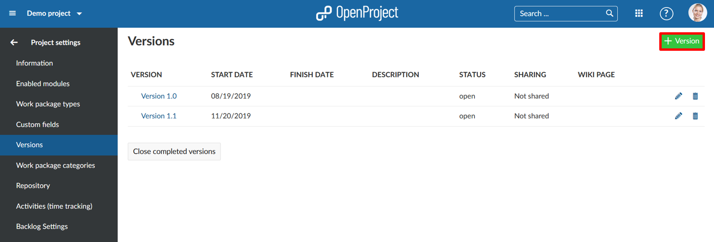
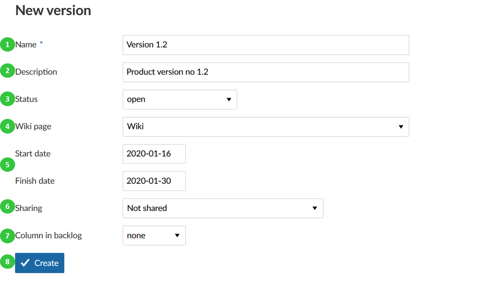
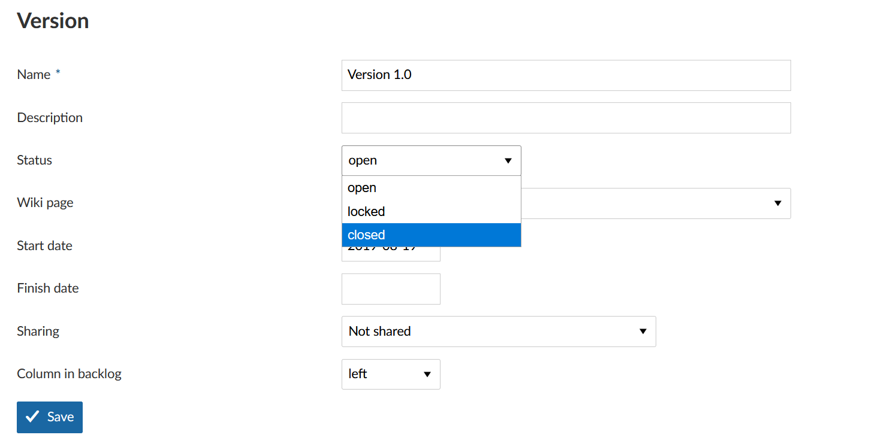

---
sidebar_navigation:
  title: Versions
  priority: 600
description: Manage versions in OpenProject.
robots: index, follow
keywords: manage versions
---
# Manage versions

Versions will be used, e.g. for roadmap planning to track certain product versions or releases. Work packages can be assigned to a version. They will be displayed in the [Roadmap](../../roadmap).

Also, version will  be used to enable the Backlogs module, i.e. to create a product backlog and sprints in OpenProject.

[Read here how to create a new backlogs version](../../backlogs/manage-sprints).

## Create a new version

Press the green **+ Version** button to create a new version for a project.

You can configure the following information.

1. Set a **name** for the version.
2. Add a **description** to specify the version.
3. Set **status** of a version, the default status is open.
4. Choose a **wiki page** that you want to open directly from a version in the Roadmap.
5. Set a **start date and finish date** for the version.
6. Choose whether the version shall be **shared** with other projects, e.g. in the project hierarchy or subprojects.
7. Select a **column in backlogs view**. This is only required if you use the versions to manage your [Scrum backlog](../../backlogs-scrum).
8. Press the blue **Create** button to save your changes.

## Edit or delete versions

1. Click on the name of a version to **edit** it or on the edit icon at the right in the row.
2. Press the **delete** button at the right of the version to delete a version.
3. You can **close all completed versions** with the button at the bottom of the list. In order to close only certain versions, open the details view and adapt the version **Status** (see above).

## Close a version

To close a version, open the details view of a version and set the **Status** to *Closed*.

