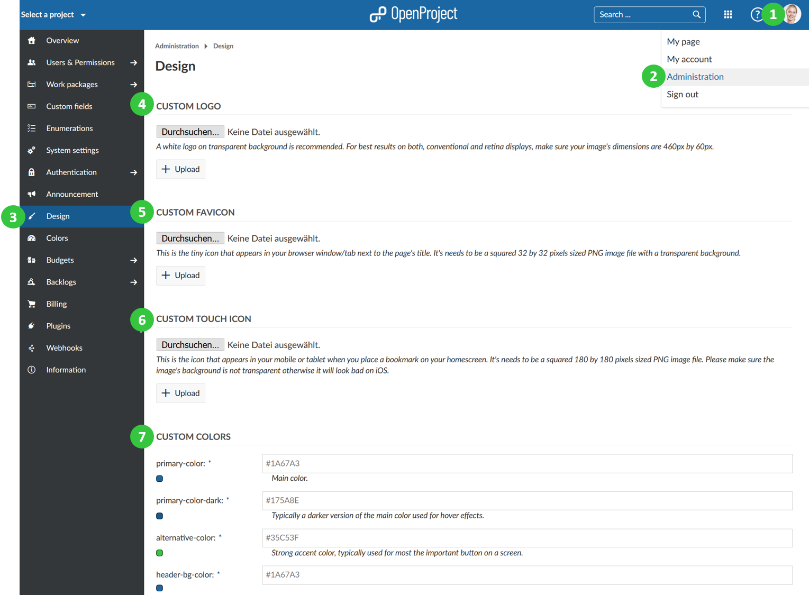
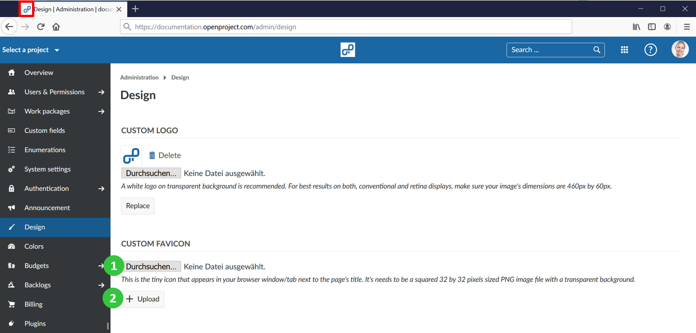
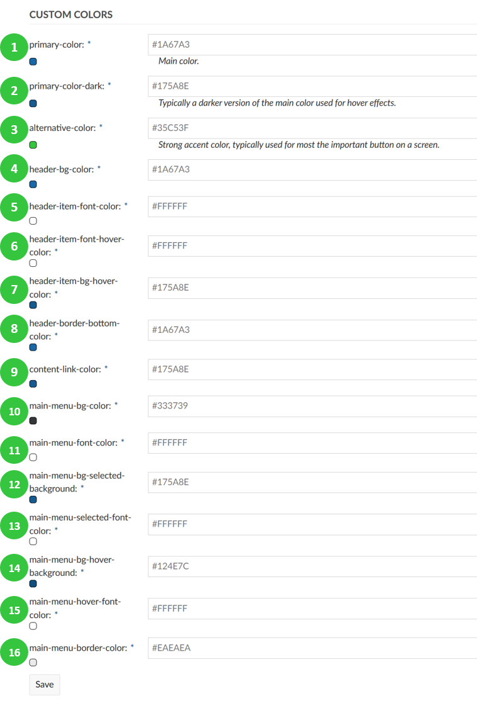

---
sidebar_navigation:
  title: Design
  priority: 700
description: Custom color, theme and logo.
robots: index, follow
keywords: custom color, theme and logo
---
# Set custom color theme and logo (Premium feature)

As an OpenProject premium feature you can replace the default  OpenProject logo with your own logo. In addition, you can define your own color theme which allows you to implement your corporate identity in OpenProject.

(1) Click on your user avatar in the upper right corner.

(2) Select *Administration* from the dropdown menu.

(3) Choose **Design** from the menu.

The design page provides several options to customize your OpenProject Enterprise Edition:

(4) Upload your own **custom logo** to replace the default OpenProject logo.

(5) Set a custom **favicon** which is shown as an icon in your browser window/tab.

(6) Upload a custom **touch icon** which is shown on your smartphone or tablet when you bookmark OpenProject on your home screen.

(7) Set **custom colors** to adjust nearly any aspect of OpenProject, such  as the color of the header and side menu, the link color and the hover color.

## Upload a custom logo

To replace the default OpenProject logo with your own logo, make sure that your logo has the dimensions 460 by 60 pixels. Select the *Choose File* button and select the file from your hard drive to upload it (1).

Click the *Upload* button to confirm and upload your logo (2).

## Set a custom favicon

To set a custom favicon to be shown in your browser’s tab, make sure  you have a PNG file with the dimensions 32 by 32 pixels. Select the *Choose File* button and select the file from your hard drive to upload it (1).

Click the *Upload* button to confirm and upload your favicon (2).

## Set a custom touch icon

To set a custom touch icon that appears on your smartphone’s or  tablet’s homescreen when you bookmark a page, make sure you have a PNG  file with the dimensions 180 by 180 pixels. Select the *Choose File* button and select the file from your hard drive to upload it.

Click the *Upload* button to confirm and upload your custom touch icon.

When you bookmark your OpenProject environment’s URL, you will see that the uploaded icon is used as a custom touch icon.

## Specify custom colors

Aside from uploading logos and icons, you can also customize the colors used within your OpenProject environment.

To do this change the color values (entered as color hex code) in the *Custom Colors* section. In order to find the right hex code for a color, you can use a website, such as [color-hex.com](http://www.color-hex.com/).
 You can see the selected color in the preview area next to the color hex code. Therefore, it is possible to see the selected color before saving the changes.

You can set the following custom colors:

1. **Primary color**: The primary color changes the color of many parts of  the application, including the color of the header and the edit buttons. Along with the alternative color, the primary color defines the  majority of your OpenProject’s color theme.
2. **Primary color dark**: This color is used for hover effects. When you  hover over links in the header navigation or select edit buttons (whose  color is set by the primary color), the primary color dark is applied.
3. **Alternative color**: The most important buttons (e.g. the work package or wiki create button) use the color defined here.
4. **Header background color**: By default, the header background color is  set through the primary color. However, you can set a separate header  background color which leaves the button colors defined by the primary  color unaffected.
5. **Header item font color**: You can separately control the font color of the links shown in the header navigation. If you define e.g. a white  header background color you should choose a darker header item font  color in order to still see the links shown in the header navigation.
6. **Header item font hover color**: With this setting you can change the  item font color shown when hovering with the mouse over entries in the  header navigation.
7. **Header item background hover colo**r: This color setting controls the  background color for the entries in the header navigation when hovering  over them with your mouse.
8. **Header border bottom color**: You can show a line right below the  header navigation. This makes sense e.g. if you are using a white header but want a clear separation to the rest of the application. Set the  color you want to use for the line below the header. Leave this setting  empty if you don’t want to display a line below the header.
9. **Content link color**: Adjust this setting in order to change the link  color (e.g. for the selected menu in the side navigation of a project or the administration or the breadcrumb color).
10. **Main menu background color**: This setting allows you to change the background color of the side menu displayed on the left side.
11. **Main menu font color**: This defines the font color in the main navigation menu.
12. **Main menu background selected background**: This color is set as background when a menu item is selected.
13. **Main menu selected font color**: The color of the font of a selected menu item.
14. **Main menu background hover background**: This is the color of the background when hovering in the menu items.
15. **Main menu hover font color**: This is the font color when hovering in the menu items.
16. **Main menu border color**: Is is the border color of the main menu.

As soon as you press the **Save** button your changes are applied and the colors of your OpenProject environment are adjusted accordingly.

 